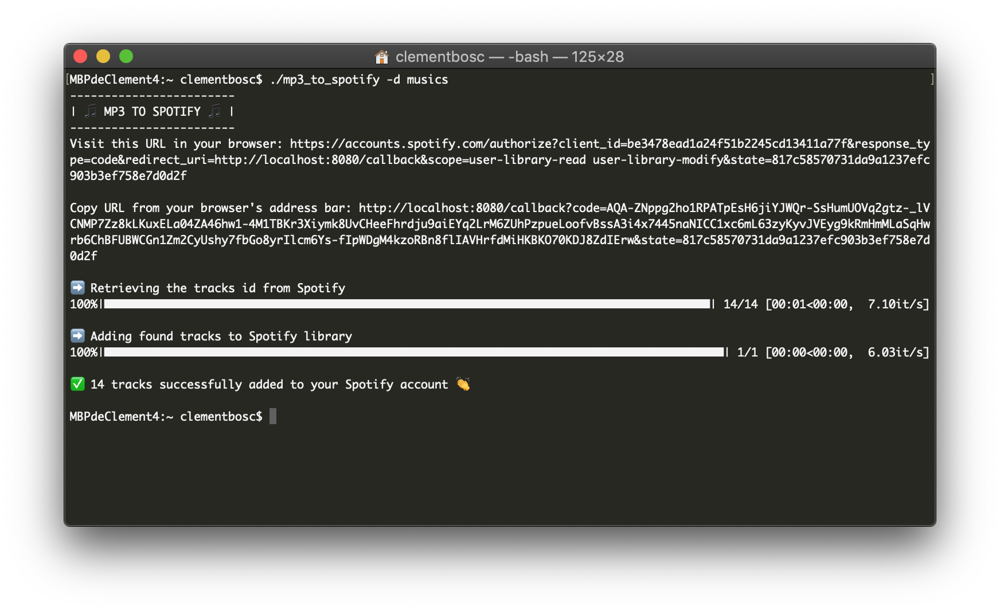

# mp3 to Spotify

This is a simple MacOS app to search and add mp3 files to user's Spotify library.

Usage : 

```
./mp3_to_spotify -d <path to music directory>
```

If you do not run MacOS, you can use : 

```
pip install -r requirements.txt

python mp3_to_spotify.py -d <path to music directory>
```

Every improvements are welcome 👍

